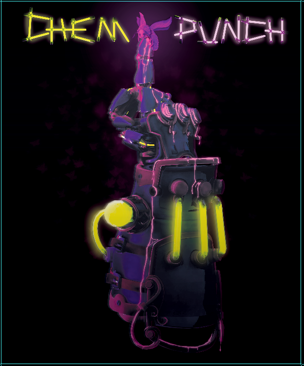
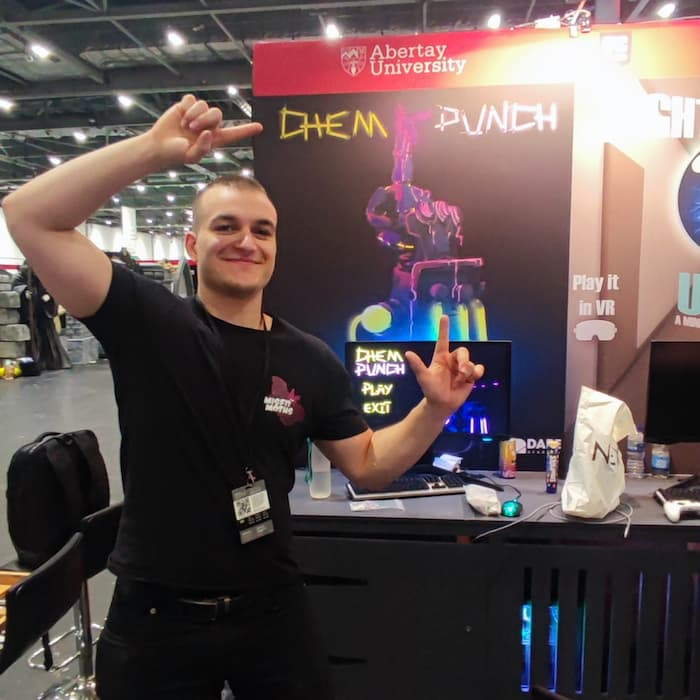
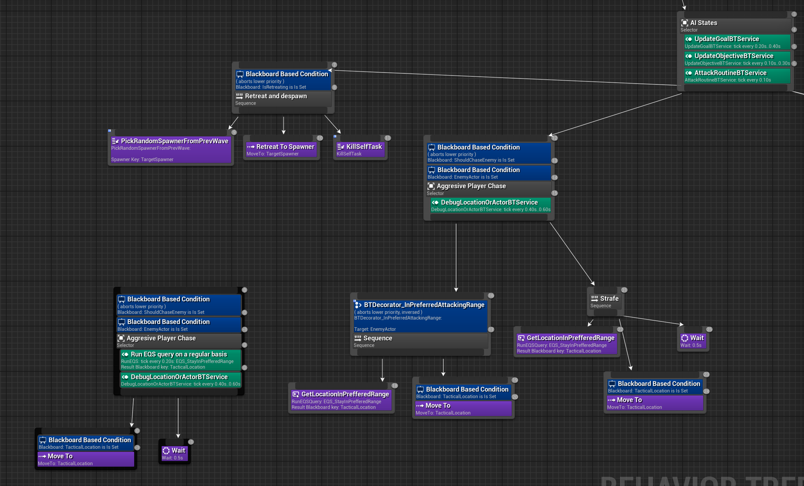
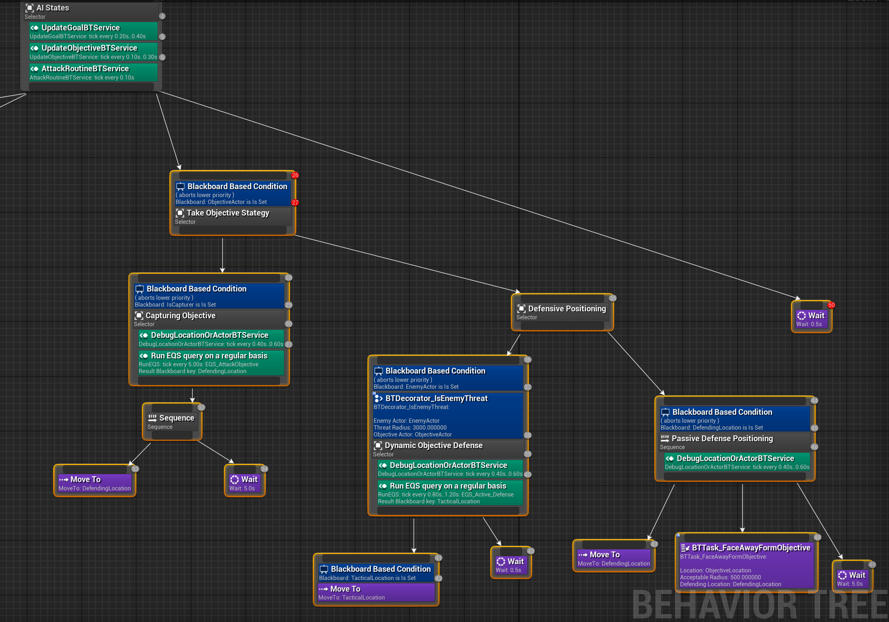

<link rel="stylesheet" href="site.css">

  <svg data-lucide="cpu" class="icon"></svg>  Unreal Engine,WWise  
  <svg data-lucide="calendar" class="icon"></svg>  May 2024 – August 2024  
  <svg data-lucide="users" class="icon"></svg>  8  
  <svg data-lucide="user-cog" class="icon"></svg>  Generalist & AI Programmer

   
  <svg data-lucide="award" class="icon"></svg> Dare Academy Finalist  
  <svg data-lucide="map-pin" class="icon"></svg> Presented at <strong>EGX x MCM 2024 London</strong>

#### Description

<!--
A first-person action-packed wave-defence experience with some resource management mechanics or 
as described in the game's pitch:

> "Chempunch is an intense wave defence action game focusing on reactive but aggressive gameplay in a chempunk world.
>  Alone but far from helpless, you must protect your slums from an oncoming horde, using chemicals you route around your body to empower different actions."
-->

  

    <!-- Replace with <video> if needed -->
<iframe   src="https://www.youtube.com/embed/68KRv2RYLxA?si=dg78yrvzcB-sfkJV" title="YouTube video player" frameborder="0" allow="accelerometer; autoplay; clipboard-write; encrypted-media; gyroscope; picture-in-picture; web-share" referrerpolicy="strict-origin-when-cross-origin" allowfullscreen></iframe>

  

A first-person action-packed wave-defence experience with some resource management mechanics or 
as described in the game's pitch:

  <blockquote>

"Chempunch is an intense wave defence action game focusing on reactive but aggressive gameplay in a chempunk world.
Alone but far from helpless, you must protect your slums from an oncoming horde, using chemicals you route around your body to empower different actions."

  </blockquote>

  

  

  

    
  

  

    
  

## Enemy Horde AI System
The AI was originally designed for a mode where enemies rushed an objective and the player intercepted them. This later shifted to wave defence, but the AI kept its flexibility.

#### Goal Prioritization
Enemies choose between the player and the objective based on navmesh distance, weighted by configurable scalars. To avoid erratic switching when scores were close, I stabilized decisions by adjusting how often priorities were updated in the behavior tree.

#### Strafing Behavior
To support strafing, I separated movement and attack goals. By tweaking their weights, enemies could act aggressively, rush the objective, or strafe while firing—creating variety in enemy types.

#### Player Awareness
Enemies use sight (via Unreal’s perception system) and sound (e.g. gunfire, ally deaths) to detect and track player. Player location is individually tracked by enemies and forgotten after a short delay.

#### Tactical Ranged Positioning
Ranged enemies maintain their distance by stepping backward while maintaining line of sight. This is handled through Unreal’s Environment Query System (EQS).

#### The Behaviour Tree

<a href="./BehaviourTreeLeft.png" class="media"  target="_blank" rel="noopener">
  

    

</a>

<a href="./BehaviourTreeRight.png" class="media" target="_blank" rel="noopener">
  

    

</a>

#### AI Coordinator – Managing Group Enemy Behavior
The **AI Coordinator** controls group-based enemy decisions that require coordination, like deciding which enemies attack the objective and which ones defend them.
To avoid overwhelming the player, a **designer-defined limit** sets how many enemies can attack at once. This caps the potential damage output and ensures a mix of behaviors.
The class is a **Singleton** and uses the **Observer** pattern, with enemies subscribing to receive role updates. These roles are applied by modifying *blackboard values*, which guide behavior tree logic.
At the start of each wave, the coordinator runs an EQS query to find defending positions arranged in a spiral around the objective (slightly offset to leave space for attackers). These positions are wrapped into custom Responsibility structs that define what each enemy should do.
Attack responsibilities always have higher priority. When an enemy dies or unsubscribes, its **task is reassigned to the nearest available enemy**, keeping the group behavior fluid and adaptive.

<button class="expand-toggle ">Controlling How Many Enemies Attack The Objecive At Once ▾</button>

<pre class="highlight">

<code>
void AAICoordinatorActor::AssignAIObjectiveRoles()
{

	// ---- Assumes All Horde Enemy AI Share An Objective ----
	Logger-&gt;Log(&quot;COORD: Assign AI ObjectiveRoles&quot;);
	UpdateAllCongestion();
	
	if (HordeEnemyAIs.Num() &lt;= 0)
		return;

	UpdateObjectiveLocationInBlackBoard(ObjectiveActor);

	//Based on who has started attacking already
	UpdateAttackerAndDefendersLists();

	//Get the free attacker slots and the max allowed attackers value 
	int attackerFreeSpots = MaxAllowedObjectiveAttackers - ObjectiveAttackers.Num();
	if(attackerFreeSpots &gt; 0)
	{
		//Add as many enemies as possible from the list of the non-attackers
		int takeNewAttackers = FMath::Min(ObjectiveDefenders.Num(), attackerFreeSpots);
		//Ordered by distance
		SortActorsByDistanceFromLocation(ObjectiveDefenders,
		ObjectiveActor-&gt;GetActorLocation());

		for (int i = 0; i &lt; takeNewAttackers ; ++i)
		{
			auto NewDefender = ObjectiveDefenders[i];
			NewDefender-&gt;GetBlackboardComponent()-&gt;SetValueAsBool(&quot;IsCapturer&quot;, true);
			//NewDefender-&gt;GetBlackboardComponent()-&gt;SetValueAsObject(&quot;EnemyActor&quot;, ObjectiveActor);
		}
	}

void AAICoordinatorActor::AssignStrategicResponsibility( AHordeEnemyAI* EnemyAI)
{

	Logger-&gt;Log(&quot;DEFRES: ENTER&quot;);
	FDefenderResponsibility* DefenderResponsibility =
		GetMostImportantStrategicResponsibility(EnemyAI-&gt;K2_GetActorLocation());

	if (DefenderResponsibility == nullptr)
		return;

Logger-&gt;Log(&quot;DEFRES: SUCCESS&quot;);
	DefenderResponsibility-&gt;DefenderAI = EnemyAI;
	EnemyAI-&gt;GetBlackboardComponent()-&gt;
	         SetValueAsVector(&quot;DefendingLocation&quot;,
	                          DefenderResponsibility-&gt;Location);
}

void AAICoordinatorActor::AssignStrategicLocationToAIs(TArray&lt;AHordeEnemyAI*&gt; DefenderArray,
                                                             TArray&lt;FVector&gt; Locations)
{
	//Only works to initialize the defenders responsibility the first time
	
	if (StrategicResponsibilities.Num() &gt; 0)
		return;

	///Initialize all the defender responsibilities
	int locationIndex = 0;
	while (Locations.IsValidIndex(locationIndex))
	{
		FDefenderResponsibility Responsibility;
		Responsibility.Location = Locations[locationIndex];
		Responsibility.DefenderAI = nullptr;
		Responsibility.Priority = GetRadiusBasedPriority(Locations[locationIndex]);
			GetRadiusBasedPriority(Locations[locationIndex]);
		StrategicResponsibilities.Add(Responsibility);
		locationIndex++;
	}

	Logger-&gt;Log(&quot;COORD: Defend Locations Are: %d&quot;, StrategicResponsibilities.Num());
	for (auto EnemyAI : DefenderArray)
	{
		AssignStrategicResponsibility(EnemyAI);

	}
}

FDefenderResponsibility* AAICoordinatorActor::GetMostImportantStrategicResponsibility(FVector ActorLocation)
{
	if(ObjectiveActor == nullptr)
		return 0;
	float maxScoreFound = FLT_MAX;
	FDefenderResponsibility* MostImportantDefenderResponsibility= nullptr;
	for (FDefenderResponsibility&amp; DefenderResponsiblity : StrategicResponsibilities)
	{
		if (DefenderResponsiblity.DefenderAI == nullptr)
		{
			float currentScore = DefenderResponsiblity.Priority;

			currentScore += UKismetMathLibrary::Vector_Distance(
				GetCurrentObjective()-&gt;GetActorLocation(), ActorLocation);
			if (currentScore &lt; maxScoreFound)
			{
				MostImportantDefenderResponsibility = &amp;DefenderResponsiblity;
				maxScoreFound = currentScore;
			}
		}
	}
	return MostImportantDefenderResponsibility;
}

void AAICoordinatorActor::SortActorsByDistanceFromLocation(TArray&lt;AHordeEnemyAI*&gt;&amp; Actors, const FVector&amp; Location)
{
	// Comparator lambda function to compare two actors based on their distance from the Location
	Actors.Sort([Location](const AHordeEnemyAI&amp; A, const AHordeEnemyAI&amp; B) {
		// Calculate squared distance from Location to avoid the cost of computing square root
		float DistanceA = FVector::DistSquared(A.GetPawn()-&gt;GetActorLocation(), Location);
		float DistanceB = FVector::DistSquared(B.GetPawn()-&gt;GetActorLocation(), Location);

		// Return true if A is closer to the Location than B
		return DistanceA &lt; DistanceB;
	});
}

}
</code>
</pre>

## Congestion-Aware Pathfinding
To reduce bottlenecks in enemy movement and ease the burden on level designers, I extended Unreal’s default pathfinding system with a congestion-aware routing mechanism.
A custom data structure, the **Congestion Map**, tracks traffic density across navmesh nodes by associating each node with a congestion score (an unsigned integer). Every **X (contrallable parameters)** frames , the system:

*   Queries all active enemies
*   Retrieves their current navmesh node via the path-following component
*   Increments that node’s congestion score

This data is then fed into a custom **FCustomRecastNavQueryFilter**, which biases pathfinding away from highly congested areas. As a result, enemies naturally spread out and avoid forming predictable chokepoints, making encounters feel more dynamic and organic.

<button class="expand-toggle ">Updating Congestion Map Code Snippet ▾</button>

<pre class="highlight">

<code>
void AAICoordinatorActor::UpdateEnemyPerNode(TMap&lt;int64, int&gt;&amp; NodeEnemyMap) const
{
    //Initialize the enemy per node map
    NodeEnemyMap.Empty();
    for (AHordeEnemyAI* EnemyAI : HordeEnemyAIs)
    {
        NavNodeRef EnemyCurrentNatNode = GetNavNodeRef(EnemyAI);

        if(EnemyCurrentNatNode == 0)
            continue;
        //Add or increment the enemy map
        if (NodeEnemyMap.Contains(EnemyCurrentNatNode) )
            NodeEnemyMap[EnemyCurrentNatNode]++;
        else
            NodeEnemyMap.Add(EnemyCurrentNatNode, 1);

    }
}
void AAICoordinatorActor::UpdateAllCongestion()
{
    CongestionMap.Reset();

    //Update enemy count per node
    UpdateEnemyPerNode(EnemyPerNode);

    for (auto NavNodeEnemyCountPair : EnemyPerNode)
    {
        //Get the congestion value for the node
        int enemyCount = NavNodeEnemyCountPair.Value;

        UNavigationSystemV1* NavSys = UNavigationSystemV1::GetCurrent(GetWorld());
        if (ensure(NavSys))
        {
            auto NavMesh = Cast&lt;ARecastNavMesh&gt;(NavSys-&gt;GetMainNavData());
            float NavPolySize = 
                CalculatePolyAreaSize(NavNodeEnemyCountPair.Key, NavMesh);

            //Current congestion algorithm interpolates the new estimated area value
            //in the range on [0, 3*polygonArea]

            float estimatedFreeArea = NavPolySize - enemyCount * 
                this-&gt;CongestionMapParams.CongestionWeightPerEnemy;

            float congestionValue = 1 -
                UKismetMathLibrary::NormalizeToRange(estimatedFreeArea, 
                    0, NavPolySize);
            CongestionMap.Add(NavNodeEnemyCountPair.Key, congestionValue);
        }
    }
}
</code>
</pre>

#### Early prototype of the congestion-aware pathfinding system:

  

<iframe width="560" height="315" src="https://www.youtube.com/embed/ZDTWZw8w9Ts?si=w6tYqoztr5T7usXd" title="YouTube video player" frameborder="0" allow="accelerometer; autoplay; clipboard-write; encrypted-media; gyroscope; picture-in-picture; web-share" referrerpolicy="strict-origin-when-cross-origin" allowfullscreen></iframe>

## Wave System
Implemented the full wave logic, including timers, active spawners, door control, and randomised enemy distribution. All parameters are exposed in the Unreal Editor, allowing designers to easily configure and test wave setups without code changes.

## Dynamic Difficulty
Developed a designer-friendly system that tracks a score, which increases when enemies are defeated and gradually decays over time and if enemies hit the target objective. This score feeds into custom editor curves to dynamically scale enemy cap and spawn rate, adapting the game’s intensity in real time.

[back](./)
