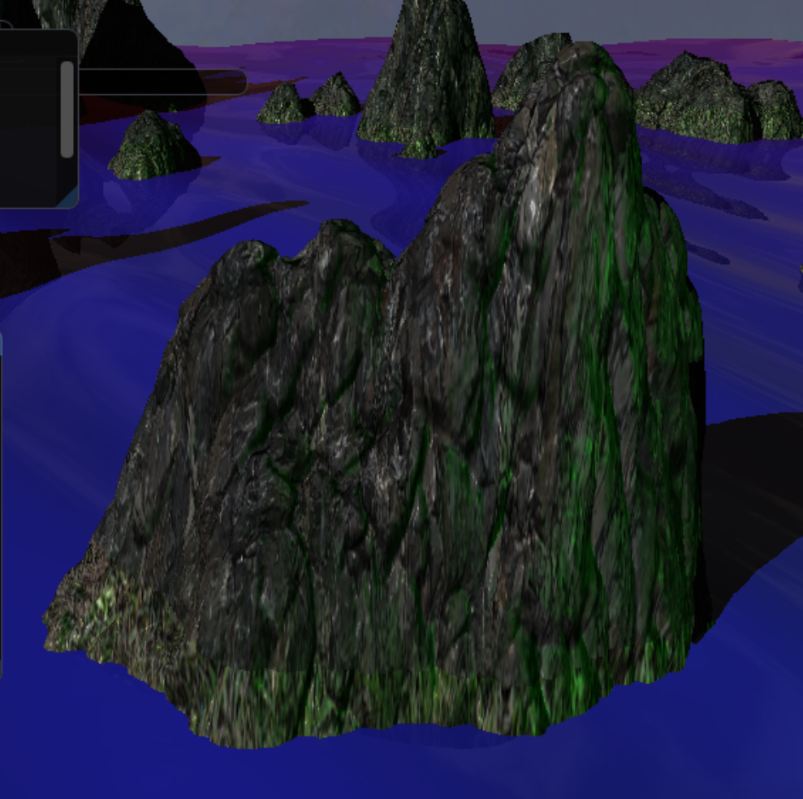
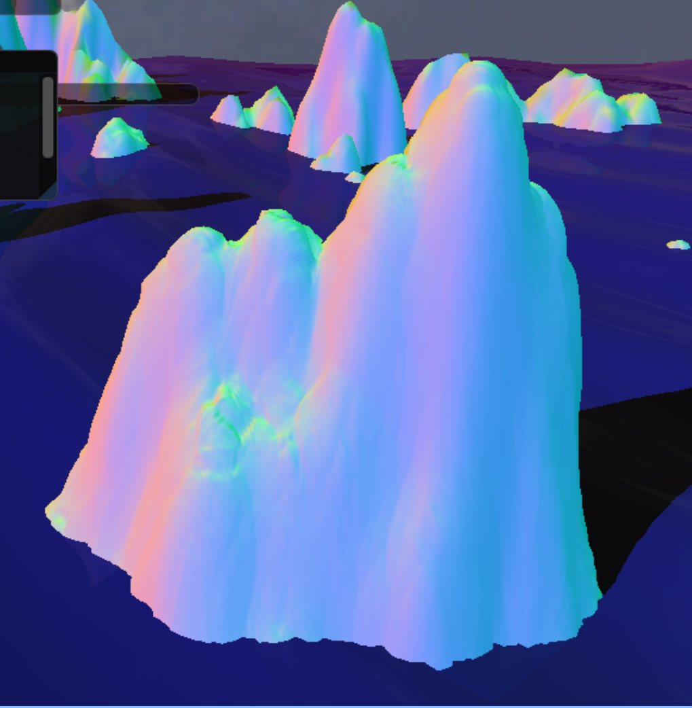
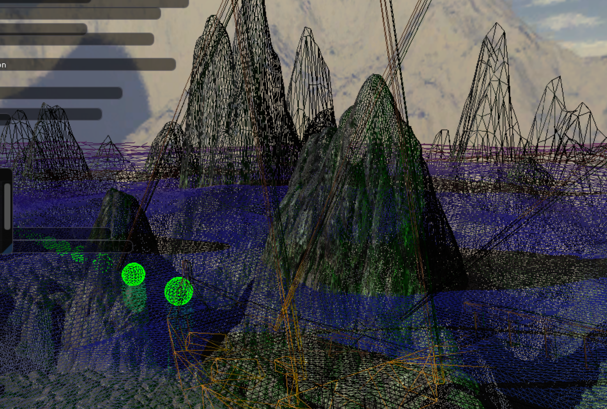
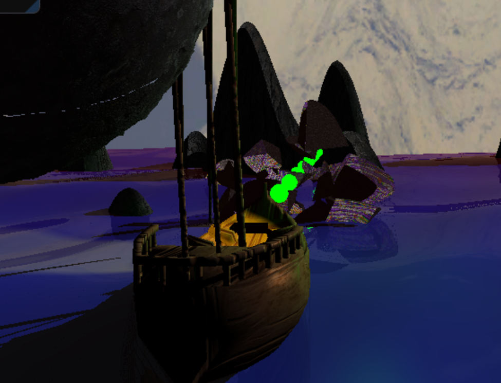
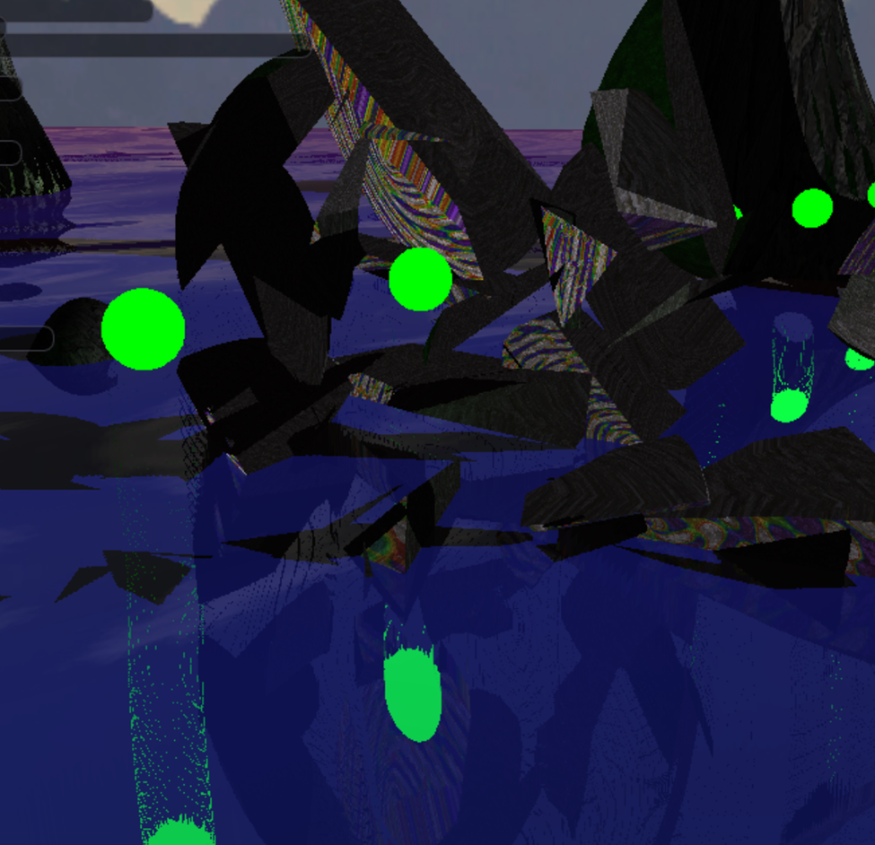

<link rel="stylesheet" href="site.css">

  <svg data-lucide="cpu" class="icon"></svg>  DX11
  <svg data-lucide="user-cog" class="icon"></svg>  Computer Graphics & Procedural Programmer

## Water Simulation - Gerstner Waves
*   Implemented a physically-inspired Gerstner Wave model in the domain shader to deform a tessellated water plane.
*   Supports multi-layered waves with editable parameters: steepness, wavelength, speed, and direction.
*   Accurate vertex normal reconstruction was done using derived tangents and bitangents per wave layer to ensure proper lighting and shading.
 
 

## Parallel Split Shadow Maps (PSSM)
*   Integrated Parallel Split Shadow Mapping (PSSM) for high-quality directional shadows with 3 cascade levels (near, mid, far).
*   Each cascade is calculated using frustum slicing and orthographic projection aligned with the light direction.
*   Light positions and properties fully configurable at runtime via GUI.
 

## Compute-shader Buoyancy 

*   The boat is physically represented by a rectangular Bullet3D body synced with the visible mesh.
*   A grid of points is sampled across the bottom hull surface each frame.
*   A compute shader evaluates each point using gradient descent to find the corresponding wave height (Gerstner waves require solving for vertical displacement, as they map 3D inputs to 3D outputs).
*   The vertical distance between each hull point and wave surface is used to estimate displaced fluid volume and generate upward buoyant forces.

 

## Screen-Space Reflection (SSR)
Realistic water surface reflections were achieved using a screen-space ray marching algorithm:
*   Ray-marching in screen space with Digital Differential Analyzer (DDA) stepping to prevent over-sampling.
*   Fallback to a cubemap-based skybox when rays leave the view frustum, avoiding visual artifacts at screen edges.
*   Exposed fidelity controls (max steps, step size, reflection opacity) via ImGui interface for real-time tweaking and performance balancing.

 

## Procedural Terrain With Procedural Destruction
#### Terrain Generation
*   Used fractal Brownian motion (fBM) to procedurally generate rocky peaks emerging from the ocean.
*   GPU terrain is recalculated every frame using dynamic tessellation and vertex displacement.
*   A parallel CPU mesh is generated once and partially recalculated only when geometry is altered (e.g., via cannon fire), enabling accurate ray-triangle intersections and collisions.

  

 
 

  

 
 

 

 

#### Destruction System
*   When terrain is hit by a cannon, the affected mesh region is extracted and converted into a destructible fragment set.
*   A sequence of randomly positioned and oriented splitting planes intersect the geometry and fragment it into jagged, rock-like chunks.
*   Each internal face is automatically inverted and retextured to distinguish the interior from the original surface.

  

 
 

  

 
 

 

  

## Retro Underwater Effect 
Achieved by combining various post-processing techniques:
*   Edge Blur: Vignette-based Gaussian blur applied only to screen edges using dynamic radial masks.
*   Water Distortion: Ripple effects applied via trigonometric distortion of UVs in the pixel shader.
*   Color Tinting & Magnification: Simulated depth distortion with a center-screen magnifier using aspect-corrected circular masks.
 

<!--
## Dynamic Tesselation
*   Edge-based tesselation adjusts the subdivision level based on distance to the camera, optimizing detail vs. performance.

## Material Shading - Displacement + Normal Mapping
Rocks and props utilize displacement mapping driven by grayscale height maps, combined with normal mapping for high detail on low-poly meshes.
-->

[back](./)
