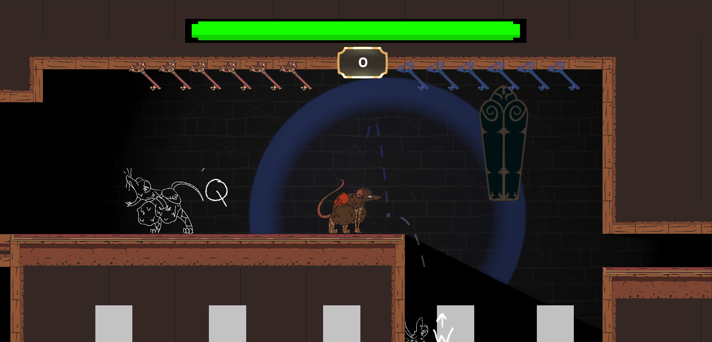
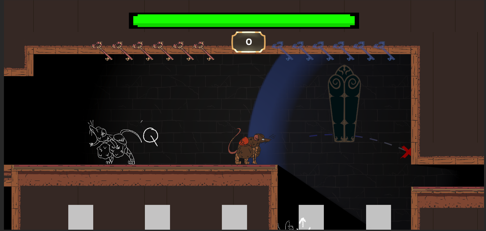

<link rel="stylesheet" href="site.css">


<script>
  document.addEventListener("DOMContentLoaded", () => {
    document.querySelectorAll('.expand-toggle').forEach(button => {
      button.addEventListener('click', () => {
        const expandable = button.closest('.expandable');
        expandable.classList.toggle('open');

        const arrow = button.querySelector('.arrow');
        if (arrow) {
          arrow.textContent = expandable.classList.contains('open') ? '▴' : '▾';
        }
      });
    });
  });

</script>

# RatKing Summary 


## Developed Systems
*   Custom navigation graph and pathfinding for 2D platforming.
*   Noise-based detection system inspired by Mark of the Ninja.
*   Fully simulated projectile trajectory preview with physics-based behavior.
*   Drag-and-drop, grid-based inventory system.
*   Modular crafting system with serialized recipe data.
*   Game persistence implemented via custom file serialization.

*   AAAA


```
AAA
BBB
```

```
private void SetTraversablePoints()
{
    for (var y = 0; y < SuperTileMap.m_Height; y++)
        for (var x = 0; x < SuperTileMap.m_Width; x++)
        {
            Vector3Int positionInGrid = new(x, -y);
            //Ladder tile is a tile that is found on ladder layer
            if (IsLadder(positionInGrid))
            {
                _traversableTiles.Add(positionInGrid);
                continue;
            }


            Vector3Int bottomTile = positionInGrid + Vector3Int.down;
            if (
                IsGround(positionInGrid, positionInGrid) == false 
                && OnGroundOrPlatform(positionInGrid)
                && IsTraversable(positionInGrid+Vector3Int.up,positionInGrid)) 
                _traversableTiles.Add(new Vector3Int(x, -y));


            Vector3 startingPositionOnbottomOfTile = _tilemapGrid.GetCellCenterWorld(positionInGrid);
            Vector3 positionOfBottomTIle = _tilemapGrid.GetCellCenterWorld(positionInGrid + Vector3Int.down);
            ContactFilter2D conmFilter2D = new ContactFilter2D();
            conmFilter2D.layerMask = LayerMask.GetMask("Ground", "Platform");
            conmFilter2D.useLayerMask = true;
            List<RaycastHit2D> hits = new List<RaycastHit2D>();
            var hitCount = Physics2D.Linecast(startingPositionOnbottomOfTile, positionOfBottomTIle,
                conmFilter2D, hits);
            Vector2 dirOfRay = (positionOfBottomTIle - startingPositionOnbottomOfTile).normalized;
            if (hitCount > 1)
            {
                _30degSlopeTiles.Add(positionInGrid);
            }

        }
}
```


<div class="expandable">
<button class="expand-toggle H2">Pathfinding and Navigation Graph ▾</button>
<div class="expand-content">

{{ "

Unity’s built-in 2D NavMesh is tailored for top-down games and proved unsuitable for RatKing’s side-on platformer layout. To enable enemy navigation across tilemap-based levels—with rigid platforms, one-way tiles, and ladders—I developed a custom A* pathfinding system. Instead of treating every tile as a node, I optimized the graph by identifying key traversal points, such as platform ends and ladder connections. This reduced complexity and improved performance. Walkable tiles were pre-filtered using spatial rules, allowing efficient preprocessing and tailored support for different enemy types.

Results from the system. The green gizmo circles are traversable tiles, the purple ones are the actual nodes in the graph and the red lines represent  the connection between them.
" | markdownify }}


<div class="image-row">
  
  
</div>

{{ "
Edge Cases - 30 degree slopes 
Note, that for both horizontal and vertical platform only the adjacent cells need to be checked. 
For example, if there is a horizontal platform exists it has to have CONNECTED walkable tiles. 
That is NOT the case with 30 degree platform - in which in between two walkable tiles there is an unwalkable (at least according to the tilemap tile).
A list with 30 degree sloped tiles is maintainted (detecting by casting a 2D physics ray downward and checking the normal ) 


" | markdownify }}


</div>
</div>


<div class="expandable">
<button class="expand-toggle H2">Throwing Mechanic - Physics-based projectile simulation ▾</button>
<div class="expand-content">

{{ "

The throwing mechanic allows the player to accurately project where a thrown item will land, essential for strategically placing sound sources to distract patrolling enemies.
 To achieve this, the system predicts projectile trajectories in advance by running a fully isolated physics simulation.


#### Physics Simulation in an Isolated Scene
To avoid interfering with the main game world, a dedicated physics scene is created at runtime.
 This scene contains all static and dynamic objects from collision layers that interact with the Collectible layer.
 
 **How it works:**


**On Start (Once):**
*   Static and dynamic object with layers colliding with the throwable item layer are copied into the Simulation World.

*   A dictionary maps dynamic objects between the main scene and the physics scene, allowing their transforms to be synchronized when need.


**Before Throw Simulation (Once):**

*   Destroyed dynamic objects are removed from the simulation scene to maintain consistency.

*   All other dynamic objects in the physics scene are reset to match their real-world state.

*    A **ghost copy** of the item - with physics componnet and noise-system components - is instantiated in the isolated physics world.

*    The **ghost copy** of the item is given initial velocity.

**Each Simulation Frame:**
*   the ghost’s position is sampled and recorded to drive a LineRenderer.

After the simulation the line renderer is used to visually display the predicted trajectory to the player.

#### Designer Tools
The throw mechanic includes several adjustable parameters to support iteration and tuning:

*   **Throwing Power Curve**: Throw strength is linearly interpolated (LERPed) between minimum and maximum power based on the distance between the player and the mouse cursor.

*   **All control values** - including min/max range, power curve, and throw offsets - are exposed in the Unity Editor for fine-tuning.

*   The visual trajectory line, thrown prefab, and related debug tools are fully configurable via ScriptableObjects or serialized fields.
" | markdownify }}

<div class="image-row">
  
  
</div>


</div>
</div>


[back](./)
