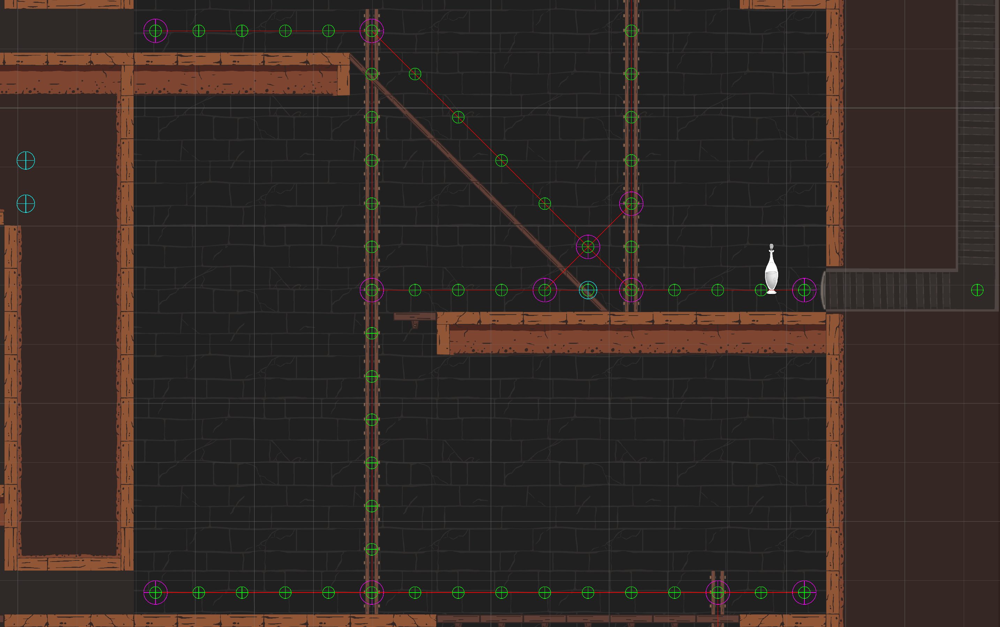

<link rel="stylesheet" href="site.css">


# RatKing Summary 
This was my first collaborative project, and while the scope was ambitious, as is often the case with young development teams, it gave me the opportunity to design and implement a wide range of interconnected gameplay systems.


## Developed Systems
*   Custom navigation graph and pathfinding for 2D platforming.
*   Noise-based detection system inspired by Mark of the Ninja.
*   Fully simulated projectile trajectory preview with physics-based behavior.
*   Drag-and-drop, grid-based inventory system.
*   Modular crafting system with serialized recipe data.
*   Game persistence is implemented via custom file serialization.


## Pathfinding and Navigation Graph
Unity’s built-in 2D NavMesh is designed primarily for top-down games and was unsuitable for RatKing’s side-on, tilemap-based platformer layout. To solve this, I developed a custom A* pathfinding system tailored specifically for platform traversal, including support for rigid platforms, one-way tiles, and ladders.

### Graph optimization 
Instead of using a naive tile-per-node graph, I optimized the system by identifying key traversal nodes (intersctions between platforms and ladders).
This reduces the memory footprint of the navigation graph as well as improves its performance.

Results from the system. The green gizmo circles are traversable tiles, the purple ones are the actual nodes in the graph and the red lines represent  the connection between them.


<!--
### Edge Case: 30-degree angled platforms
Tile traversability in the general case is computed by shooting a short ray from the tile's center downwards. If the ray hits nothing tile is free to traverse, is the layer hits 
layer from the ground layer mask is specified as occupied.
Unlike flat platforms—where adjacent traversable/walkable tiles form a continuous surface,  platforms angle at 30degrees have interleaved unwalkable tiles, breaking continuity in a naive check.

Solution:
* Extended raycast length to the center of the bottom cell. If two tiles are intersected the tile is a part of a 
* Maintained a list of known 30° slope tiles
* If a platform is connected in a direction such as (2,1), (-2,1) or any other variation in which ray length exceeds adjacent tiles, 30 degrees slope check is performed with additional 
logic to treat the known 30 slope tiles as walkable
* This approach ensured slope transitions were properly connected and didn’t create false path interruptions.
-->

### Setting traversable/walkable points

```
private void SetTraversablePoints()
{
    for (var y = 0; y < SuperTileMap.m_Height; y++)
        for (var x = 0; x < SuperTileMap.m_Width; x++)
        {
            Vector3Int positionInGrid = new(x, -y);
            //Ladder tile is a tile that is found on ladder layer
            if (IsLadder(positionInGrid))
            {
                _traversableTiles.Add(positionInGrid);
                continue;
            }


            Vector3Int bottomTile = positionInGrid + Vector3Int.down;
            if (
                IsGround(positionInGrid, positionInGrid) == false 
                && OnGroundOrPlatform(positionInGrid)
                && IsTraversable(positionInGrid+Vector3Int.up,positionInGrid)) 
                _traversableTiles.Add(new Vector3Int(x, -y));


            Vector3 startingPositionOnbottomOfTile = _tilemapGrid.GetCellCenterWorld(positionInGrid);
            Vector3 positionOfBottomTIle = _tilemapGrid.GetCellCenterWorld(positionInGrid + Vector3Int.down);
            ContactFilter2D conmFilter2D = new ContactFilter2D();
            conmFilter2D.layerMask = LayerMask.GetMask("Ground", "Platform");
            conmFilter2D.useLayerMask = true;
            List<RaycastHit2D> hits = new List<RaycastHit2D>();
            var hitCount = Physics2D.Linecast(startingPositionOnbottomOfTile, positionOfBottomTIle,
                conmFilter2D, hits);
            Vector2 dirOfRay = (positionOfBottomTIle - startingPositionOnbottomOfTile).normalized;
            if (hitCount > 1)
            {
                _30degSlopeTiles.Add(positionInGrid);
            }

        }
}
```

<!--
-->
### Optimizing graph
Once the traversable tiles are known, they are stored in a list. Connective tiles along a platform are defined by having two walkable neighbours symmetrically around them. Those tiles are treated as redundant, as there is only one direction of movement to follow on them. All other tiles are stored in the optimized graph. The connection in the optimized graphs is formed by greedy walks along traversable tiles in the directions right, right-down, right-up, and optionally down (only if ladder). This handles horizontal, vertical, and 45-degree ground and one-way platforms.


## Grid Inventory System
Implemented a modular, grid-based inventory system where items of varying shapes occupy multiple cells.
The system features **placement validation**, **real-time feedback**, and integrates seamlessly with the **throwing mechanic** when items are dragged outside the inventory grid.

<iframe width="560" height="315" src="https://www.youtube.com/embed/utv19VgP6UI?si=lvIjgqFw6KVwBuKa" title="YouTube video player" frameborder="0" allow="accelerometer; autoplay; clipboard-write; encrypted-media; gyroscope; picture-in-picture; web-share" referrerpolicy="strict-origin-when-cross-origin" allowfullscreen></iframe>

### Architecture & Design Patterns

*  **Observer Pattern**: implemented via Unity events (OnInventoryUpdate, OnUniqueItemAdded) to trigger UI updates and reward progress.
*  **Separation of Concerns**:
    *   **Inventory** class handles core logic and state.
    *   **Inventory Grid View** managed UI input, rendering, and placement feedback.


### Inventory Item - a data-first approach
**Collectible** components interact with the proximity-based collection system, acting as the bridge between world objects and the inventory.
 Each __Collectible__ holds a reference to an __InventoryItemData__ *ScriptableObject*, which defines key inventory-related properties such as gold value,
  grid size, sprite, and display name.

When picked up, an **InventoryObject** is instantiated using the referenced **InventoryItemData**, creating an inventory-specific version of the item.
 The **InventoryObject** stores instance-specific state — including occupied grid cells, in-inventory position, and a reference to the original prefab 
to be used by the throwing mechanic.


```
  public bool IsInGrid(Vector3Int cell)
  {
      return (-GridDimensions.x/2.0f <= cell.x 
               && cell.x < GridDimensions.x/2.0f 
               && -GridDimensions.y / 2.0f <= cell.y 
               && cell.y < GridDimensions.y / 2.0f);
  }
  public bool CanPlaceItem(InventoryObject item)
  {
      var isValidPosition = true;
      
      //ItemToPlace.UpdatePosition(cooridinatePointedByMouse, InventoryGrid);
      var cellsInItem = new List<Vector3Int>(item.OccupiedCells);
      isValidPosition = 
          cellsInItem.All(c => IsInGrid(c) 
                          && IsOccuiedByotherItem(c) == null);
      cellsInItem =  
          cellsInItem.Where(c => IsInGrid(c) 
                          && IsOccuiedByotherItem(c) == null).ToList();
      return isValidPosition;
  }

  public void PlaceItem(InventoryObject item)
  {
      if (CanPlaceItem(item))
      {
          this.Items.Add(item);
          //this.TotalGoldValue += item.ItemData.GoldValue;

          if (OnInventoryUpdated != null)
              OnInventoryUpdated.Invoke();

          if (!UniqueCollectablesHashes.Contains(item.UniqueCollectibleHash))
          {
              UniqueCollectablesHashes.Add(item.UniqueCollectibleHash);
              if (OnUniqueItemAdded != null)
                  OnUniqueItemAdded(item);

          }
      }
     
  }


  public InventoryObject PickItem(Vector3Int cell)
  {
      var item = GetItem(cell);
      if (item != null)
      {
          this.Items.Remove(item);

          if (OnInventoryUpdated != null)
              OnInventoryUpdated.Invoke();
      }
      return item;
  }
```


### Designer Tools

*   **Inventory Colors**: a style ScriptableObject lets deignser customize overlay highlights for valid/invalid cell states.

*   **Cell Prefab Architecture**: Each cell is a standalone prefab, allowing further customization if needed.


<!--
```
    private void Update()
    {
        ResetHighlights();
        Vector3Int cooridinatePointedByMouse = Grid.WorldToCell(Mouse.current.position.ReadValue());


        if (ItemToPlace != null && ItemToPlace.ItemData!=null)
        {
            ItemToPlace.UpdatePosition(cooridinatePointedByMouse, Grid);
            bool canPlace = Inventory.CanPlaceItem(ItemToPlace);
            UpdateCellVisual(ItemToPlace.OccupiedCells, canPlace);
        }
        
    }
```
-->
## Throwing Mechanic - Physics-based projectile simulation 

The throwing mechanic allows the player to accurately project where a thrown item will land, essential for strategically placing sound sources to distract patrolling enemies.
 To achieve this, the system predicts projectile trajectories in advance by running a fully isolated physics simulation.


#### Physics Simulation in an Isolated Scene
To avoid interfering with the main game world, a dedicated physics scene is created at runtime.
 This scene contains all static and dynamic objects from collision layers that interact with the Collectible layer.
 
 **How it works:**


**On Start (Once):**
*   Static and dynamic object with layers colliding with the throwable item layer are copied into the Simulation World.

*   A dictionary maps dynamic objects between the main scene and the physics scene, allowing their transforms to be synchronized when needed.


**Before Throw Simulation (Once):**

*   Destroyed dynamic objects are removed from the simulation scene to maintain consistency.

*   All other dynamic objects in the physics scene are reset to match their real-world state.

*    A **ghost copy** of the item - with physics component and noise-system components - is instantiated in the isolated physics world.

*    The **ghost" copy** of the item is given initial velocity.

**Each Simulation Frame:**
*   The ghost’s position is sampled and recorded to drive a LineRenderer.

After the simulation the line renderer is used to visually display the predicted trajectory to the player.

#### Designer Tools
The throw mechanic includes several adjustable parameters to support iteration and tuning:

*   **Throwing Power Curve**: Throw strength is linearly interpolated (LERPed) between minimum and maximum power based on the distance between the player and the mouse cursor.

*   **All control values** - including min/max range, power curve, and throw offsets - are exposed in the Unity Editor for fine-tuning.

*   The visual trajectory line, thrown prefab, and related debug tools are fully configurable via ScriptableObjects or serialized fields.

<div class="image-row">
  
  
</div>


## Data Persistence
Game data was persisted using prettified JSON files with a custom .rtk extension.
Serialization and deserialization were handled via Unity’s built-in JsonUtility and System.Serializable attributes.

**Architecture**

A centralized DataPersistenceManager is responsible for coordinating save/load operations across all systems:

*   On load, it searches the scene for all objects implementing the IDataPersistence interface.

*   Each object provides Load(GameData) and Save(ref GameData) methods to synchronize with the global GameData struct.

*   GameData serves as a monolithic container for all game state, composed of smaller, modular sub-structs (e.g., InventorySaveData, PlayerProgressionData).

When a save file is read from disk:

*   The JSON content is parsed into a GameData struct.

*   The manager iterates through all IDataPersistence implementers and calls their Load() function with the parsed data.

*   An OnLoaded event is triggered if additional initialization is required after data binding.

This modular approach ensures that each system (e.g., inventory, upgrades, player state) can independently serialize and restore its own data without tightly coupling logic to the persistence layer.

[back](./)
