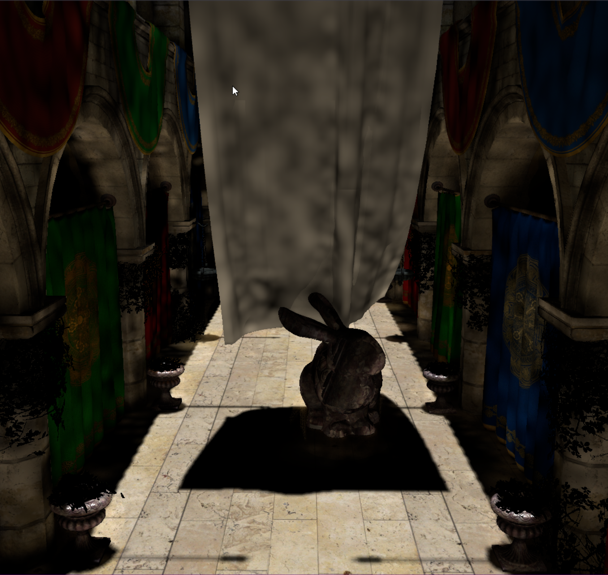
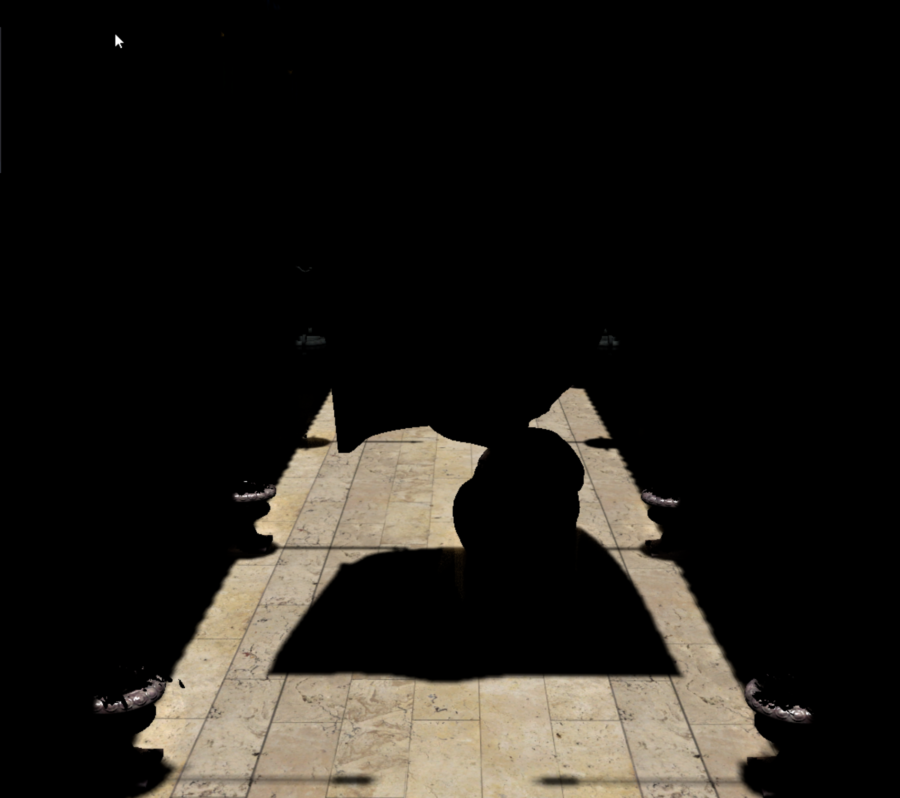
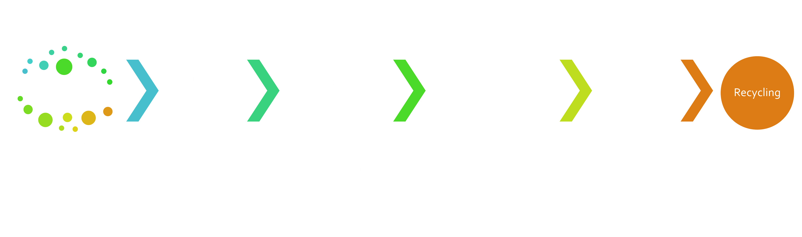
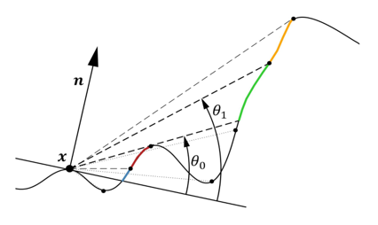
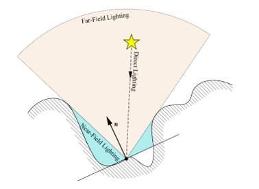
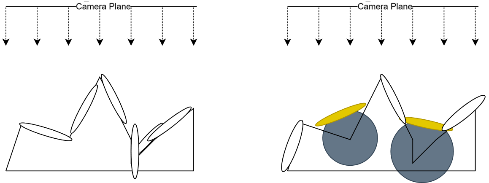
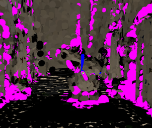
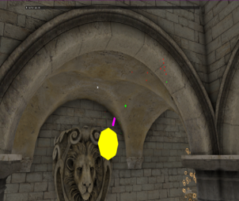

<link rel="stylesheet" href="site.css">

  <svg data-lucide="cpu" class="icon"></svg> C++, DirectX 12 (DXR), HLSL, MiniEngine  
  <svg data-lucide="users" class="icon"></svg> Solo Project  
  <svg data-lucide="user-cog" class="icon"></svg> Researcher & Graphics Programmer  

## Project Overview

  

  

  

  

Modern engines like **Frostbite** (used in Skate 3 and EA College Football) rely on advanced **global illumination (GI)** to simulate how light bounces between surfaces in real time. One of Frostbite’s more recent approaches is **surfel-based global illumination (SBGI)**, as introduced in _Global Illumination Based on Surfels (GIBS)_. This technique discretizes irradiance directly on surfaces, but it suffers from **overspawning surfels** in regions with high normal variation (such as foliage), which leads to wasted performance.

This project re-creates an SBGI pipeline and augments it with a screen-space approximation to address that inefficiency. I introduce the **Near-Far Surfel Sphere (NFSS)**, a hybrid structure that:

* Uses a sphere to approximate near-field lighting via horizon-based indirect lighting (HBIL).

* Uses a surfel to estimate far-field lighting through horizon-angle sampling.

By spawning these hybrid surfels only in regions with high ambient occlusion, the method allows controllable tradeoff between surfel redundancy and lighting accuracy.

The system was implemented in **DirectX 12 (DXR)** on **MiniEngine**, with custom HLSL shaders.

---

<!--
## Role and Responsibilities
- Investigated state-of-the-art **Global Illumination Based on Surfels (GIBS)** to establish a research baseline.  
- Designed and implemented a custom **Surfel-Based Global Illumination (SBGI) pipeline**, optimized for diffuse-only environments with a simplified acceleration structure tailored to project scope.  
- Integrated **Horizon-Based Indirect Lighting (HBIL)** as a robust near-field diffuse lighting term.  
- Developed the novel **Near-Far Surfel Sphere (NFSS)** data structure to mitigate overspawning in dense or occluded geometry.  
- Created **confidence blending heuristics** to combine surfel irradiance with screen-space approximations without double counting.  
- Performed in-depth **GPU profiling and debugging** with PIX, analyzing pass-level frame time distribution.  
- Authored a comprehensive dissertation detailing methodology, evaluation, and future research directions.  
---
-->

## Surfel-Based GI (Baseline)
<!--
The baseline SBGI pipeline included:
- **Stochastic screen-space spawning** with coverage/contribution heuristics.  
- **Acceleration structures** (surfel grids and ranges) for efficient lookup.  
- **Irradiance accumulation** with Monte Carlo ray sampling and multi-scale mean estimator.  
- **Application & blending** of surfel irradiance into the PBR pipeline.  
- **Recycling strategies** for efficient surfel memory usage.  
-->

---

## HBIL Integration
To address overspawning and missing near-field detail, I integrated **Horizon-Based Indirect Lighting (HBIL)** into the surfel GI pipeline.  
- **Near-field contribution:** HBIL reuses horizon sampling to approximate diffuse indirect light in regions where surfels are inefficient (dense foliage, fine detail).  
- **Far-field estimation:** The algorithm also generates **bent normals** and **bent cones**, which serve as predictors of incoming far-field radiance.  
- **Engine integration:** The implementation was adapted to MiniEngine’s deferred rendering pipeline, requiring adjustments for right-handed coordinates and on-the-fly G-buffer linearization.  
- **Noise reduction:** Sampling ranges were constrained, and HBIL results were blended with surfel irradiance to improve stability.  

  

  

  

  

_(Left) HBIL near-field irradiacne_
_(Right) Far-field radiance estimation via bent cones_

---

## Near-Far Surfel Sphere (NFSS)
Building on HBIL’s bent-cone output, I designed a novel structure: the **Near-Far Surfel Sphere (NFSS)**.  
- **Hybrid structure:** Each NFSS stores a spherical region for near-field contributions (computed via HBIL) and a **phantom far-field surfel (FSS)** reconstructed from the bent cone to account for global illumination contributions. 
- **Selective spawning:** NFSS instances are placed in regions of high occlusion, guided by a combination of SSAO values and bent-cone aperture.  
- **Impact:** This approach reduced overspawning in dense or concave areas while preserving perceptual lighting quality.  

_(Left) general case of surfel coverage_
_(Right) the "perfect" case coverage with the NSFF structure_

  

  

  

  

_(Left) debug view of the NFSS structure in-engine_
_(Right) interactive debug view on mouse cursor_

---

## Blending and Confidence Heuristics
To prevent **double counting** of irradiance:
- Implemented **confidence blending** between surfel and HBIL outputs.  
- Adjusted blending weights based on **SSAO and surfel density**.  
- Ensured HBIL acted as an augmenting term, not a competing one.  

---

<!--
## Technical Highlights
- Custom **GPU-friendly prefix-sum** acceleration for surfel grid construction.  
- **Compute shader optimizations** with warp-level grouping.  
- **PIX GPU profiling** to identify HBIL bottlenecks.  
- Debug visualizations for **bent cones, NFSS placement, and irradiance consistency**.  

---
-->

## Future Work
- Interleaved/denoised HBIL to reduce GPU cost.  
- More adaptive spawning/recycling heuristics (SSAO + bent-cone + surfel density).  
- Quantitative validation against **ray-traced ground truth**.  

[back](./)
