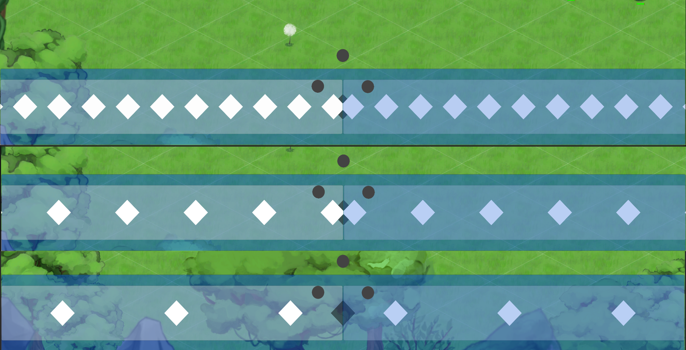
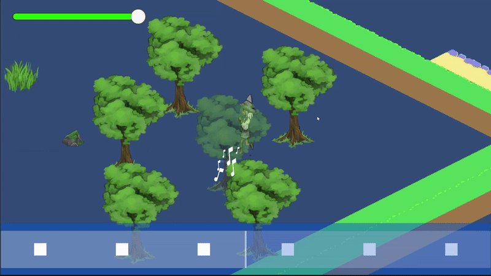

<link rel="stylesheet" href="site.css">

  <svg data-lucide="cpu" class="icon"></svg>  Unity, WWise
  <svg data-lucide="calendar" class="icon"></svg>  Feb 2025 To May 2025
  <svg data-lucide="users" class="icon"></svg>  7
  <svg data-lucide="user-cog" class="icon"></svg>  Project Lead & Programmer

   
  <svg data-lucide="gamepad" class="icon"></svg>
    <a href="https://somethingsmthn.itch.io/toot-the-lute" target="_blank">
      Toot the Lute on Itch.io
    </a>

#### Role and Responsibilities
Led a team of junior developers on their first project. Established scope, production workflow, and delivery schedule.  

*   Developed a core **rhythm input system**, including **beatmap streaming**, synchronization to Wwise audio, and **dynamic calibration**.
*   Implemented combat mechanics: **rhythm-synced attacks**, **dashes**, and **interactable environment objects**.
*   Designed modular **boid-based AI** for enemies and boss.
*   Created visual polish with **custom shaders**, **keyframe effects**, and **tweening**.
*   Integrated **dynamic transparency**, room/door logic, tutorial triggers, and environment interactivity.
*   Defined and enforced project scope, managed Git version control, and integrated WWise.

## Rhythm System
At the core of Toot the Lute is a custom-built rhythm system that synchronizes fast-paced action gameplay with beat-based timing mechanics. Drawing inspiration from games like BPM and Crypt of the NecroDancer, this system transforms combat into a musical challenge, rewarding precision and timing.
The heartbeat of the game. All gameplay events are synced to beatmaps parsed from Wwise audio timestamps.

#### Beatmap
The beatmap system is decoupled from the actual soundtrack, allowing flexible rhythm structuring independent of audio tracks.
It’s defined using looping BeatmapSegment structures—each segment is a list of Beats that contain:
*   Beat duration (in beat counts)
*   IsPause flags
*   Loop number

This setup enables infinite looping patterns and modular rhythm composition.
Although the system supports complex beatmaps, Toot the Lute primarily uses a simple, repeating beat pattern, adjusting only the BPM per track for gameplay variation.

#### Beat Detection and Input Grading
The system detects beats in real time by parsing track BPM and aligning gameplay logic to musical timing windows.
When player input is detected, the system checks player input against the current beat window and determines if the input should be accepted or rejected.
This ties back to player attack, dash, and combo systems.

Additionally, the beats themselves have an event that is invoked once the beat is passed, whether successful or not.
 This allows environmental objects to have their visuals, cooldowns, and effects all tied to the beat.

#### Visual Beat Track
To help players stay in rhythm, I implemented a visual beat track that displays incoming beats as markers approaching a central strike zone. The track dynamically streams from the beatmap, ensuring there are always enough beats to present on the screen.

Additionally, how fast beats are perceived to approach or how zoomed in the track is is controlled by a **human-centered designed property** named *VisibleBeatsAtOnce*. The bottom picture shows the effect of changing that property.

 

<button class="expand-toggle ">Beatmap Code Snippet ▾</button>

<pre class="highlight">

<code>
void Update()
{
if(IsInputCallibration)
{
    RedrawPlayTrackedInputsOnBeatTrack();
}

for (int i = 0; i &lt; BeatObjects.Count; i++) 
{
    var beatObject = BeatObjects[i];
    //Color the active beat object
    //beatObject.gameObject.GetComponent&lt;RawImage&gt;().color = Color.white;

    float timeToBeatArrival = GetTimeToBeatArrival(i, true);
    if (timeToBeatArrival &lt; -DestroyAfter)
    {
        indicesOfBeatToDestroy.Add(i);
    }
    //Only check the beats that are not marked for destruction
    if (timeToBeatArrival &lt; -HalfInputError &amp;&amp; i &gt;= ApproachingBeatIndex)
    {
        if (BeatObjects[ApproachingBeatIndex].State != BeatObjectState.Successful)
        {
            BeatObjects[ApproachingBeatIndex].State = BeatObjectState.Unsuccesful;

        }

        //Beat passed udapte arriving time 
        ApproachingBeatIndex++;
    }

    float offsetFromTargetX = CalculateBeatOffsetFromTargetPosition(i);

    //Move the beat object along the track
    var rectTransform = beatObject.gameObject.GetComponent&lt;RectTransform&gt;();

    if (beatObject.State != BeatObjectState.Successful)
    {

        rectTransform.localPosition = new Vector3(
            Target.localPosition.x + offsetFromTargetX,
            rectTransform.localPosition.y,
            rectTransform.localPosition.z);

    }
}
Debug.Log($&quot;Should Load More Beats: {ShouldLoadLoopingBeats()}&quot;);
if(ShouldLoadLoopingBeats())
{
    // AddOnBeatsFromBeatmap();
    AddOnBeatObjectFromBeatmap();
    
}

foreach (var indices in indicesOfBeatToDestroy)
{
    Destroy(BeatObjects[indices].gameObject);
    BeatObjects.RemoveAt(indices);
    ApproachingBeatIndex--;
}
indicesOfBeatToDestroy.Clear();
}
</code>
</pre>

#### Technical Highlights

*   Synchronized Wwise playback via ElapsedTime instead of event callbacks to ensure frame-perfect input timing.
*   Efficient beatmap streaming with dynamic object pooling.
*   Modular, serialized beat segments allow infinite track looping.
*   Unity editor tools for beat visualization, boid debugging, and room/door control.

## Combat System
All actions must be timed to beats.
Attacks: Trigger visual and physical effects (colliders, particles, shaders).
Dashes: Invulnerability movement synced to rhythm.
Special Attacks: Reward perfect rhythm streaks with amplified damage and visuals.
Interactables: In-world objects (trees, bushes) that sync to the beat and can be used in combat.

## AI Systems

Simple but expressive systems based on modular boid logic.
Includes: **Seek**, **Pursue**, **Flee**, **Separate** and **Custom Obstacle Avoidance** behaviours.
Integrated beat-timed attack behavior using Wwise beat events.

  

<iframe width="560" height="315" src="https://www.youtube.com/embed/ozx9z03v268?si=hbtAgIE_ZfT9o-li" title="YouTube video player" frameborder="0" allow="accelerometer; autoplay; clipboard-write; encrypted-media; gyroscope; picture-in-picture; web-share" referrerpolicy="strict-origin-when-cross-origin" allowfullscreen></iframe>

  

  

<iframe width="560" height="315" src="https://www.youtube.com/embed/FBxBe7EE92Y?si=aj9wHN5kgL68q_pQ" title="YouTube video player" frameborder="0" allow="accelerometer; autoplay; clipboard-write; encrypted-media; gyroscope; picture-in-picture; web-share" referrerpolicy="strict-origin-when-cross-origin" allowfullscreen></iframe>
  

## Dynamic Transparency

Applies transparency to foreground objects blocking player view.
Based on distance and render layer.
Configurable range per object.
<!---->

## Visual Polish
*   Shader graph was utilized to create the bottom layer (Shockwave) of the player attack effect.
*   Particle systems added game juice to players attacks and served as feedback on enemies hit/death.
*   The motion of the "blobs" that spawn when slime is killed is "faked" by tweening their size and their shadow size based on elapsed time.

  

 <!---->

  

  

 <!---->

  




[back](./)
