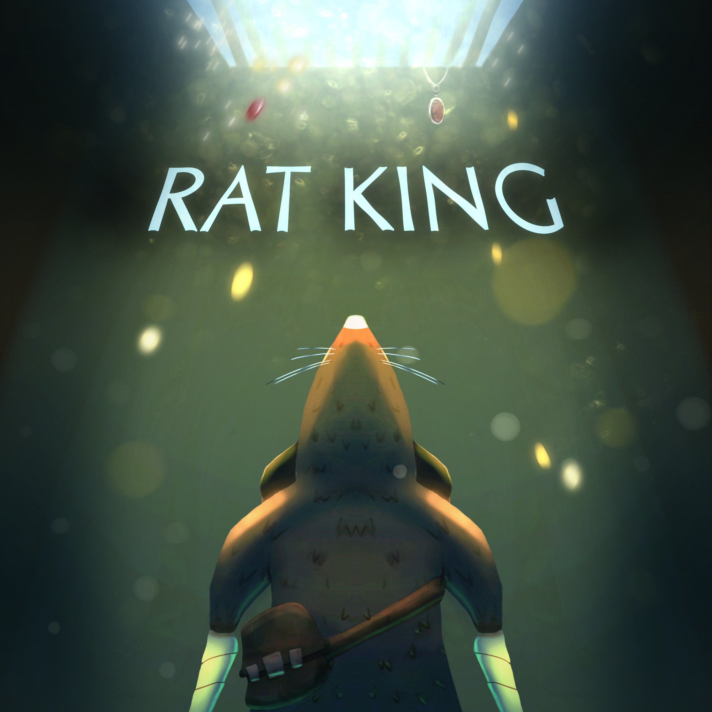

<link rel="stylesheet" href="site.css">

**About Me**

Passionate game programmer with hands-on experience since 2017. Started with backend web development in C#/ASP.NET, then transitioned fully into game programming to pursue systems-driven, creative development.
I recently graduated with **First Class Honours**, with a dissertation focused on **procedural stealth-level generation**. I'm currently completing a master's thesis on **optimizing surfel-based global illumination**.
My core interests lie in building **gameplay systems**, **real-time graphics**, and **developer tools** that empower designers and accelerate iteration.

[See More --->](./about-me.html)

<a href="mailto:teodorshopov01@gmail.com" target="_blank" style="text-decoration: none; color: inherit;">
  

    <svg data-lucide="mail" class="icon"></svg>
  

</a>
<a href="https://github.com/TediShopov" target="_blank" style="text-decoration: none; color: inherit;">
  

    <svg data-lucide="github" class="icon"></svg>
  

</a>

<h2>Chempunch</h2>
<!--

  <svg data-lucide="cpu" class="icon"></svg>  Unreal Engine,WWise  
  <svg data-lucide="calendar" class="icon"></svg>  May 2024 – August 2024  
  <svg data-lucide="users" class="icon"></svg>  8  
  <svg data-lucide="user-cog" class="icon"></svg>  Generalist & AI Programmer

-->

  <svg data-lucide="cpu" class="icon"></svg>  Unreal Engine
  <svg data-lucide="award" class="icon"></svg> Dare Academy Finalist  
  <svg data-lucide="map-pin" class="icon"></svg> Presented at <strong>EGX x MCM 2024 London</strong>

  

    <!-- Replace with <video> if needed -->

<iframe   src="https://www.youtube.com/embed/QnLPjNRj2Zg?si=e1Z3GXbthDfSVBGe&start=13&autoplay=1" title="YouTube video player" frameborder="0" allow="accelerometer; autoplay; clipboard-write; encrypted-media; gyroscope; picture-in-picture; web-share" autoplay=1  referrerpolicy="strict-origin-when-cross-origin" allowfullscreen></iframe>
  

  

    <h4>Notable Contributions</h4>
    <ul>
      <li>  Enemy horde AI utilizing behaviour trees, EQS, custom AI utility functions</li>
      <li>  Congestion-aware pathfinding </li>
      <li>  Controllable dynamic difficulty system</li>
    </ul>
  

Chempunch is a first-person wave-defence action game in which I worked as generalist and AI programmer.
Additionally, I helped with plugin integration (WWise) across multiple environments, conducted extensive profiling for performance and bug fixing and 
helped with git merges.

<!--
I developed a modular **enemy AI** system using utility scoring,**behavior trees** and **Environemnt Query System (EQS)**,
 implemented a **congestion-aware pathfinding** extension, and built a **dynamic difficulty** system that scaled challenge based on player performance.

-->

[See More --->](./Chempunch.html)

## Toot The Lute 

  <svg data-lucide="cpu" class="icon"></svg>  Unity, WWise
  <svg data-lucide="calendar" class="icon"></svg>  Feb 2025 To May 2025
  <svg data-lucide="users" class="icon"></svg>  7
  <svg data-lucide="user-cog" class="icon"></svg>  Project Lead & Programmer

   
  <svg data-lucide="gamepad" class="icon"></svg>
    <a href="https://somethingsmthn.itch.io/toot-the-lute" target="_blank">
      Toot the Lute on Itch.io
    </a>

  

    <!-- Replace with <video> if needed -->

<iframe  src="https://www.youtube.com/embed/cBHClumqTLE?si=Pl0p3jJeSZclAKhN" title="YouTube video player" frameborder="0" allow="accelerometer; autoplay; clipboard-write; encrypted-media; gyroscope; picture-in-picture; web-share" referrerpolicy="strict-origin-when-cross-origin" allowfullscreen></iframe>

  

  

    <h4>Notable Contributions</h4>
    <ul>
      <li>Rhythm-based input system</li>
      <li>Rhythm-synced attacks, dashes and combos</li>
      <li>Beat track with approaching visual beat cues</li>
      <li>Dynamic input/audio and visual/audio latency calibration</li>
    </ul>
  

Toot The Lute combines the isometric combat of Hades with the rhythm game system inspired by Bullets Per Minute (BPM). In creating this project I served as a team lead, leading a team of 2nd-year university game developers on their first game development project. Additionally, I also assumed the role of the project's sole programmer and the responsibility of placing every created asset in the engine.

[See More --->](./TootTheLute.html)

## Ratking 

  <svg data-lucide="cpu" class="icon"></svg>  Unity
  <svg data-lucide="users" class="icon"></svg>  7
  <svg data-lucide="user-cog" class="icon"></svg>  Programmer

  

    <!-- Replace with <video> if needed -->
 
  

  

    <h4>Notable Contributions</h4>
    <ul>
      <li>
 Custom pathfinding and automatic PF graph builder
</li>
      <li>
 Noise-based distraction/sensory system
</li>
      <li>
    Fully physics simulated projectile trajectory preview
</li>
      <li>
 Classic stealth game state machine
</li>
    </ul>
  

Ratking is a stealth-platformer game in which you play as a rat trying to infiltrate a mansion of cats. 
This was a professional project in my 3rd university year, which was in accordance to a extraction-game brief provided by Modern Wolf.

[See More --->](./RatkingMD.html)

<!--
## Solving surfel over-spawning in surfel-based global illumination
Engine: **DX12/MiniEngine**,  Role:  **Graphics Programmer**
-->

## Computer Graphics Project

  <svg data-lucide="cpu" class="icon"></svg>  DX11
  <svg data-lucide="user-cog" class="icon"></svg>  Computer Graphics & Procedural Programmer

  

    <!-- Replace with <video> if needed -->
 
  

  

    <h4>Notable Contributions</h4>
    <ul>
      <li>Procedural Terrain (fBM)</li>
      <li>Procedural Destruction</li>
      <li>Procedural Gerstner Waves</li>
      <li>Compute Shader Buoyancy integrated with physics engine Bullet3D</li>
      <li>Screen-Space Reflections + DDA</li>
      <li>Parallel-Split Shadow Maps</li>
    </ul>
  

This project simulates an immersive rocky ocean environment where the player pilots a ship capable of destroying procedural terrain.
It combines work from **three separate university modules**, showcasing a range of computer graphics techniques.
The implementation covers both **foundational** and **intermediate** graphics concepts,

[See More --->](./ComputerGraphicsApp.html)

